# OptiFaχ - Optical Facsimilie Toolkit - Introduction
# An object-oriented digital optical bench for MATLAB  

[https://github.com/McCrackenLab/OptiFax](https://github.com/McCrackenLab/OptiFax)

```matlab:Code
clear; close all; devFlag = 0;
```

##  1. What is an object (in this context)?

```matlab:Code
figure
fig_handle = gcf
```

```text:Output
fig_handle = 
  Figure (1) with properties:

      Number: 1
        Name: ''
       Color: [0.9400 0.9400 0.9400]
    Position: [817 612 560 420]
       Units: 'pixels'

  Show all properties
```

```matlab:Code
fig_handle.Position(3:4) = [400 200];
ax_handle = axes(fig_handle);
pl_handle = plot(ax_handle,1:10,'r-o');
```

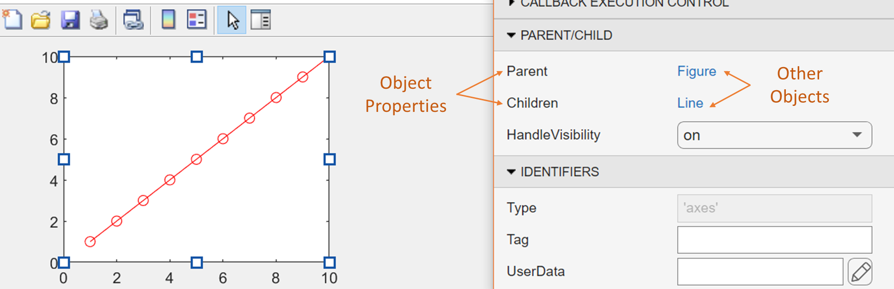

  

**Unlike with other classes, variables assigned to an existing object handle still point to the original instance of the object:**

```matlab:Code
new_handle = pl_handle;	
pl_handle == new_handle %#ok<EQEFF>
```

```text:Output
ans =    1
```

This ensures object permanence, just as we would expect from physical objects!

```matlab:Code
new_handle.Color = [0 1 0];	% Changing the property in the newly assigned variable
```

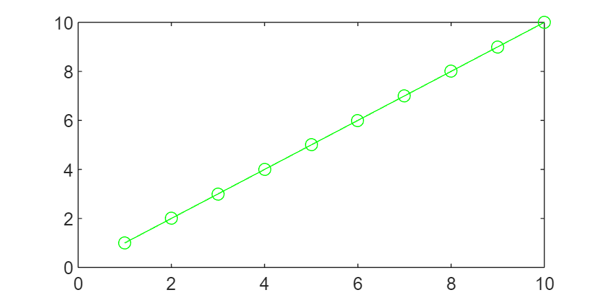

```matlab:Code
pl_handle.Color		% Changes that property for all variables referencing the same object
```

```text:Output
ans = 1x3    
     0     1     0

```

Here we changed the value of a ***property*** in this instance of a line object. 

The ***methods*** required to redraw the line on screen are also part of the line object's class.

We can use these principles to create digital versions of the elements in a real optical system!

##  2. Creating an optical source object with OptiFaχ

Let's use the [**'Laser'**](toolbox/lib/classes/Laser.m) object class to create an optical source for our system. The following code is taken from a script which is included in the toolbox: [laser_setup_Taccor800](toolbox/scripts/setupObjects/lasers/laser_setup_Taccor800.m)

```matlab:Code(Display)
open("laser_setup_Taccor800.m")
```

Initialise physical parameters:

```matlab:Code
name = "Taccor800";	% Used as filename and also stored with the object as an identifier
lambdaC = 800e-9;	% Central wavelength, used when generating idealised pulses [m]
waistR = 5e-6;		% Beam waist radius, used for default area outside of waveguides [m]
fRep = 1e9;			% Repetition rate [Hz]
power = 2.1;		% Average power [W]
spectralString = "Sech";	% For now, model as idealised Sech^2 temporal pulse shape
dtau = 31.5e-15;	% FWHM pulse duration exiting the laser [s]
dlam = 23e-9;		% Spectral FWHM used with idealised pulse shapes [m]
```

Create the laser object:

```matlab:Code
laser = Laser(lambdaC,waistR,fRep,power,spectralString,dtau,dlam);
```

Object methods are called using the` 'object.method(args)' `syntax, allowing the same function to be implemented differently for different objects. 

Many OptiFaχ objects implement` '.store' `for saving in a format compatible with the rest of the toolkit.

```matlab:Code
laser.store(name,devFlag)
```

To test our new laser, we need to give it a coordinate system to exist in, and there's an object for that too! The [**'SimWindow'**](toolbox/lib/classes/SimWindow.m) object class.

```matlab:Code(Display)
load("simWin.mat")
```

```matlab:Code
nPoints = 2^15;		% Always a power of two for efficient Fourier transforms
tRange = 12e-12;	% Temporal window size [s]
simWin = SimWindow(lambdaC,nPoints,tRange);
```

The `'.simulate(window)'` command brings the laser into the space, allowing it to produce OpticalPulse objects.

```matlab:Code
laser.simulate(simWin);
```

A convenience plot function, contained in the OpticalPulse class, shows the result:

```matlab:Code
laser.Pulse.plot;
```

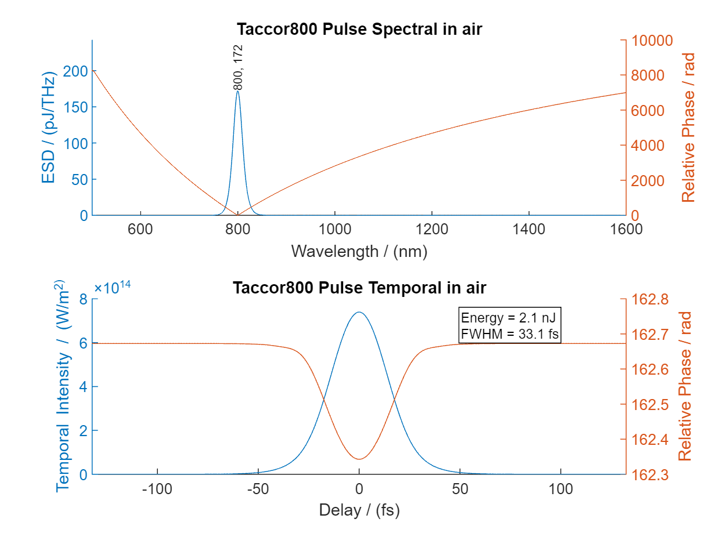

If we have an experimentally retrieved spectrum, we can use that file to generate a more representative pulse. If the file is the result of a full pulse retrieval, then we can incorporate real phase data too. A [live script](toolbox/formatSpectrum.mlx) is included to aid in formatting spectral data for use with OptiFaχ.

```matlab:Code(Display)
load Chromacity1040.mat
laser.simulate(simWin);
laser.Pulse.plot([1000 1060]);
```

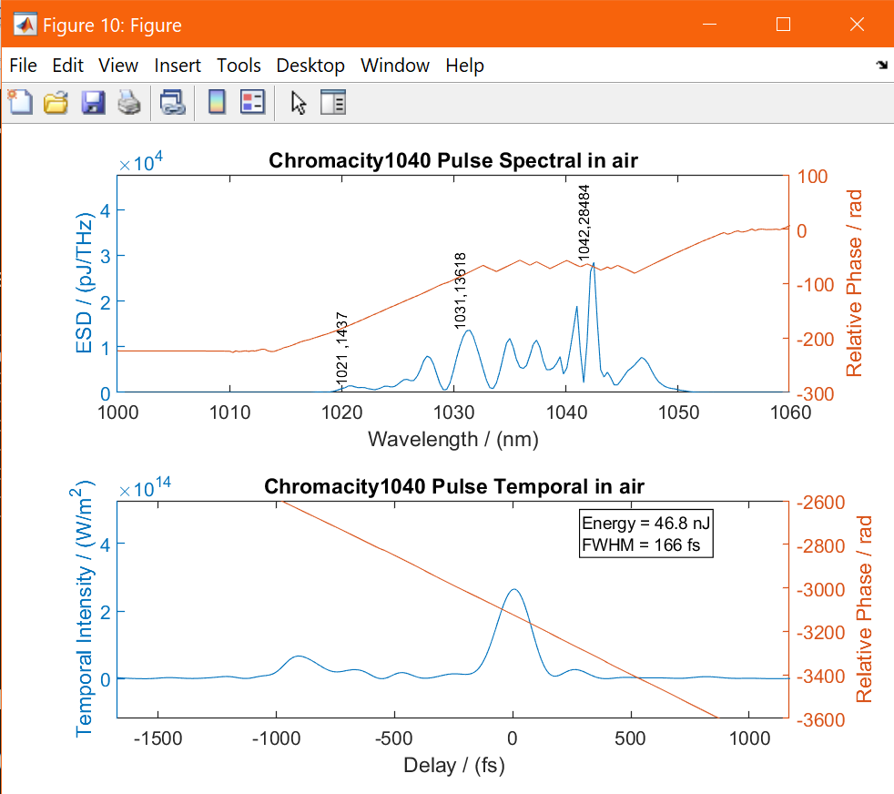

Crucially, the laser object exists independently of the choice of window, allowing it to be used in any simulation. 

This also means that the saved laser doesn't have to store any bulky arrays:

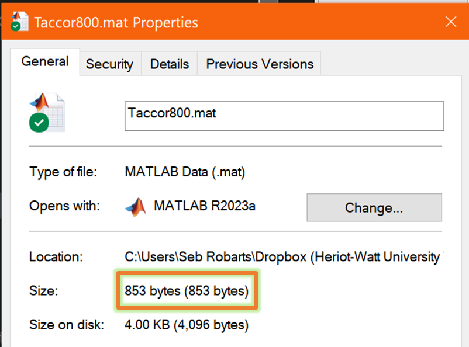

##  3. Adding components of an optical system

Most linear optical components can be implemented by direct use of the [**'Optic'**](toolbox/lib/classes/Optic.m) class.

The simplest example is a mirror with a theoretically uniform transmission across all wavelengths:

```matlab:Code
% First argument defines the regime as transmissive ("T") or reflective ("R")
% Second argument defines the transmissive properties of the first optical coating
% This can be a single value, wavelength dependent data from file, or
% Fresnel when set to "None" (input angle can be varied accordingly) 
mirror = Optic("R",0.05);
mirror.simulate(simWin);
mirror.plot;
```

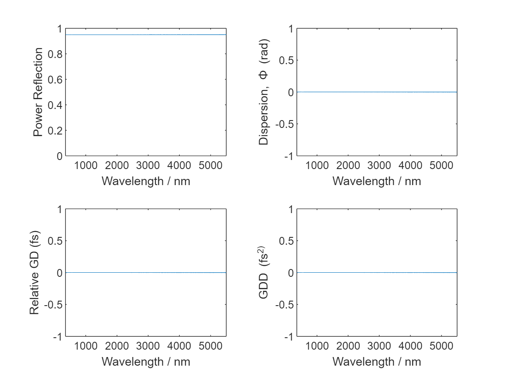

A more interesting example is implementation of a real focus lens:

```matlab:Code
% Third argument gives the material as a string and an external reference
% table finds the relevant sellmeier coefficients and transmission file
lens_surface_coating_str = 'NIR2CoatingDataLens.xlsx';
lens_thickness = 3.8E-3;
lens = Optic("T",lens_surface_coating_str,"N-BK7",lens_thickness);
lens.simulate(simWin);
lens.plot;
```

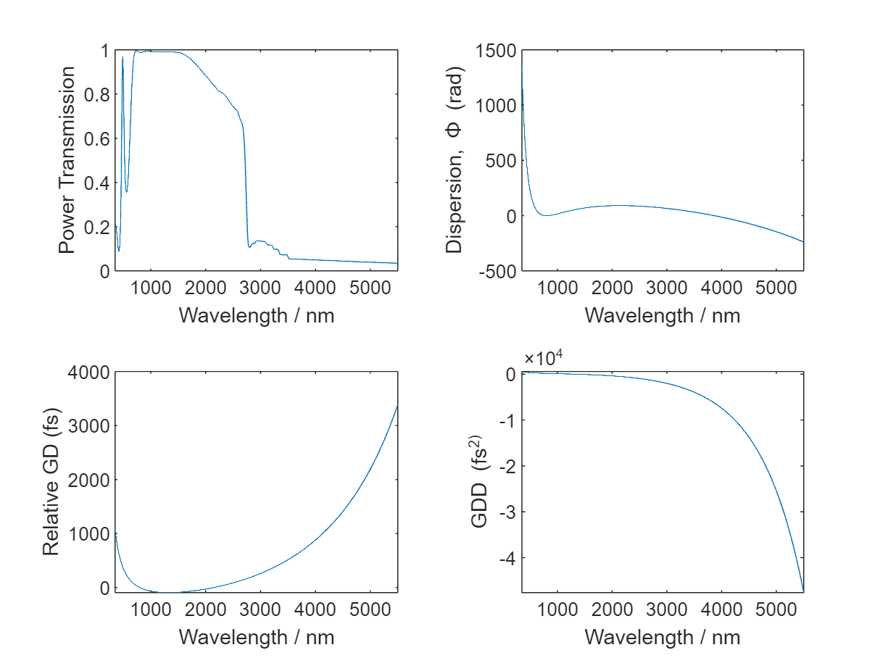

Optics with geometric dispersion can be implemented by replacing the fixed material length argument with a function handle for generating path lengths as a function of refractive index. For these Pellin-Broca prisms, we also add a non-zero angle of incidence.

```matlab:Code
theta = 57;	% angle of incidence in degrees
prismPB = Optic("T",'None',"N-BK7",@prismfn_PB,57);
prismPB.simulate(simWin);
prismPB.plot;
```

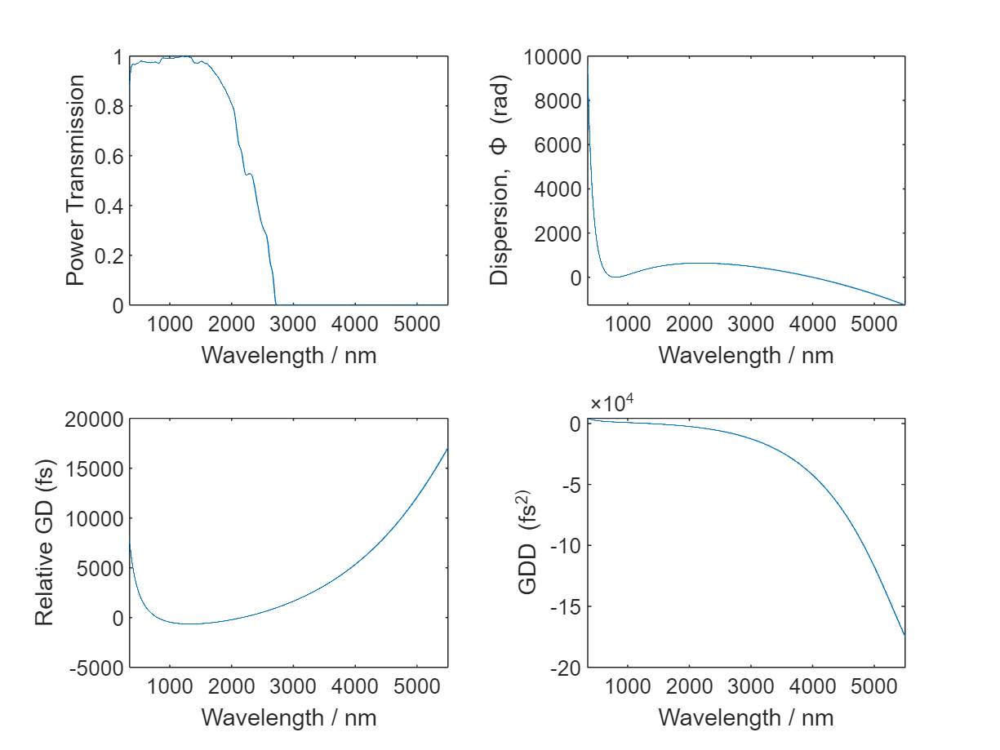

A fused silica, low-pass filter:

```matlab:Code
FS_LPF = Optic("T",'950_longpass_dichroic_transmission.csv',"FS",1.2e-3);
```

An uncoated sapphire window used for output coupling in the Fresnel regime: 

```matlab:Code
SapphireOC = Optic("T","None","Sapphire",2e-3,5);
```

###  3.2 Waveguides / Nonlinear optical components

Optic class inheritance:

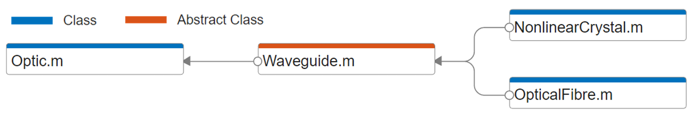

```matlab:Code(Display)
classdef Waveguide < Optic
	%WAVEGUIDE Abstract optical waveguide class
	%   Provides an interface to extend the Optic class to nonlinear media, where individual waveguide types
	%   are implemented in their own classes, extending this one.
	%
	%	Sebastian C. Robarts 2024 - sebrobarts@gmail.com
	properties
		Chi2	% Second order optical nonlinearity [V/m]
		Chi3	% Todo: Implement conversion of gamma [W/m] to Chi3 [V/m]
		RamanFraction
		ResponseTimes	% [Inverse average phonon frequency, Characteristic phonon dampening time] [s]
		ModeFieldDiameter	% Waveguide confinement [m]
	end
	properties (Abstract)
		StepSize	% Default smallest step implemented separately in each subclass [m]
	end
	properties (Dependent)
		RamanResponse	% Calculated Raman response function
	end
```

Periodically poled lithium niobate (PPLN) implementation:

```matlab:Code
%% General Optic arguments
T_str = 'ppln_ar_combined.csv';
theta_in = 0;
temp_C = 70;	% Crystal temperature in Celsius - can be adjusted later for different systems
L = 1e-3;
opticArgs = {T_str,"PPLN",L,theta_in,T_str,temp_C};
name = "PPLN_Fanout_1mm";

%% Crystal specific arguments
grating_m = 21.3e-06;	% Grating period [m]
uncertainty_m = 0.2e-6;	% Small perturbation in domain wall locations [m]
dutyOff = 0.1;	% Systematic offset of duty cycle within each period %
xtalArgs = {grating_m, uncertainty_m, dutyOff};

PPLN = NonlinearCrystal(xtalArgs{:},opticArgs{:});
PPLN.store(name,devFlag); PPLN.simulate(simWin); 
PPLN.plot; PPLN.xtalplot;
```

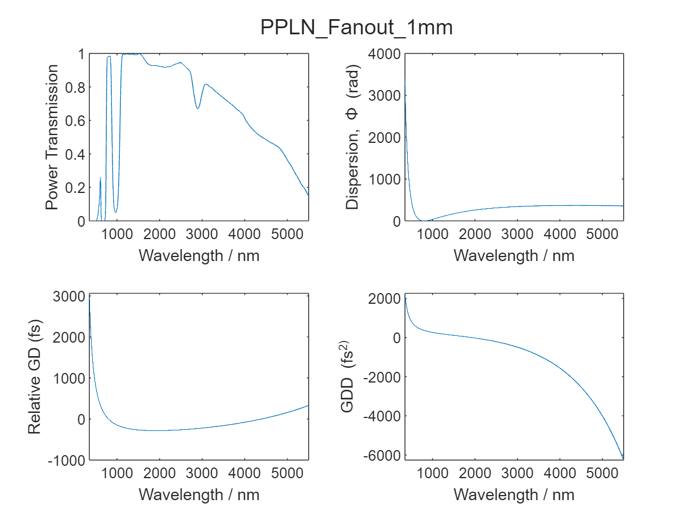

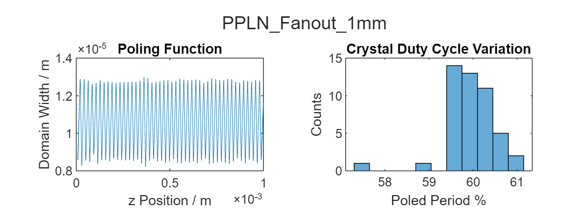

Chirped domain engineering:

Passing a function handle, f(z), as the grating period allows complete control over crystal polarisation.

```matlab:Code
%% General Optic arguments
T_str = 'AR';	% Idealised 100% anti-reflection coating across all wavelengths
theta_in = 0;
temp_C = 20;
L = 5e-3;
opticArgs = {T_str,"PPLN",L,theta_in,T_str,temp_C};
name = "ChirpedWaveguideLN";

%% Crystal specific arguments
% Chirped grating function arguments:
P1 = 6.3*1e-6;	% Starting grating period [m]
P2 = 2.2*1e-6;	% Finishing grating period [m]
a = 0.48;		% Exponent for rate of chirp
uncertainty_m = 0.1e-6;	% Small perturbation in domain wall locations [m]
dutyOff = 0;	% Systematic offset of duty cycle within each period (not currently implemented for chirped)
grating_m = @(z) chirpedgrating(z,P1,P2,a,uncertainty_m);
xtalArgs = {grating_m, uncertainty_m, dutyOff};
mfd = 5e-6;	% Mode Field Diameter [m]

CPLN = NonlinearCrystal(xtalArgs{:},opticArgs{:});
CPLN.ModeFieldDiameter = mfd;
CPLN.store(name,devFlag); CPLN.simulate(simWin);
CPLN.plot; CPLN.xtalplot;
```

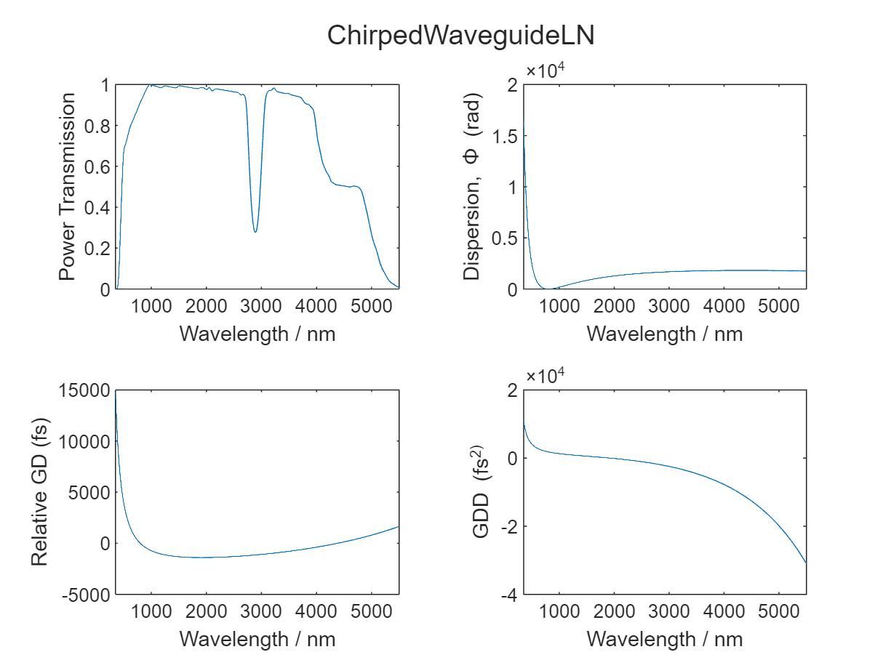

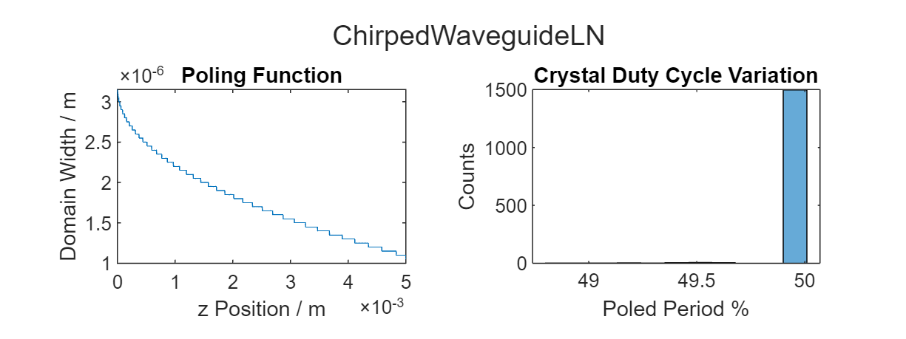

##  4. Combining optical components with [**'Cavity'**](toolbox/lib/classes/Cavity.m) objects

Cavity class dependency:


Optics are composed of a combination of optical surfaces and bulk dielectric. Cavities are, in turn, composed of a combination of optics.

Pre-cavity optics:

We can define additional optics to account for pump pulse dispersion prior to the cavity itself. In this example we streamline the process by only considering the total bulk material that the pump passes through.

```matlab:Code
preCavBK7 = Optic("T","AR","N-BK7", 14.6e-3);
preCavFS  = Optic("T","AR","FS", 1.2e-3);
```

For convenience, we can also define an optic to account for the majority of the 'free space' in the cavity. This helps to account for environmental water absorption under non-ideal conditions:

```matlab:Code
intraCavAir = Optic("T","None","air",0.9);
```

Cavity definition:

First, collect optical components and order them into two tables:

```matlab:Code
tblPreCavOptics = table(preCavBK7,preCavFS);
tblCavOptics = table(lens,PPLN,lens,SapphireOC,prismPB,intraCavAir,prismPB,FS_LPF);
```

The same optical handle can be used more than once, just be aware that they point to the same instance of the object.

Create the cavity:

```matlab:Code
name = "PB_Prism_OPO_333MHz";
OCpos = 4;	% Sets the default cavity position to record output pulse spectra
PBcav = Cavity(tblCavOptics,OCpos,tblPreCavOptics);
PBcav.store(name,devFlag);
```

Now that we've created and saved our cavity, it's time to clear the workspace and demonstrate the advantages of going through this setup process.

```matlab:Code
clear;
load PB_Prism_OPO_333MHz
load simWin
cav.simulate(simWin); cav.plot;
```

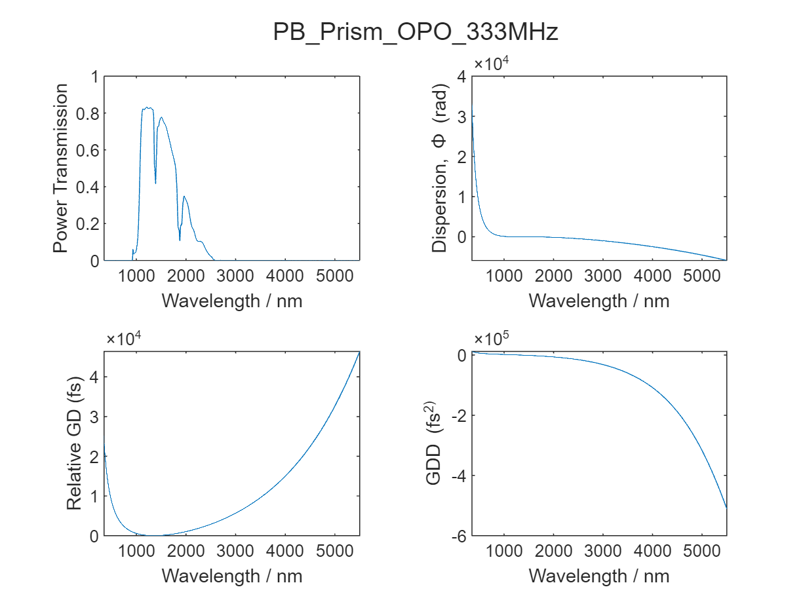

In just a few lines of code, and loading only a couple of MB of data, we can pull the entire optical system into our choice of space and simulate the combined effects of all associated optics.

##  5. Bringing everything together into a simulation

We continue the theme by utilising yet another custom object to manage the physical interactions between an optical source and our newly created cavity. The computational processing goes on inside an instance of the [**'OpticalSim'**](toolbox/lib/classes/OpticalSim.m) class.

To run a simulation with default parameters, we need only three things: an optical source; a cavity; and a simulation window. Let's clear the workspace again to demonstrate:

```matlab:Code
clear
load GigajetTiSapph % Load a laser as our optical source
load PB_Prism_OPO_333MHz % Load our cavity once again
load simWin % and the simulation window from above

optSim = OpticalSim(laser,cav,simWin);	% Create the optical sim object	
optSim.RoundTrips = 100;
optSim.setup	% Use the built in setup method to simulate all components and initialise values
optSim.run		% Then run!
```

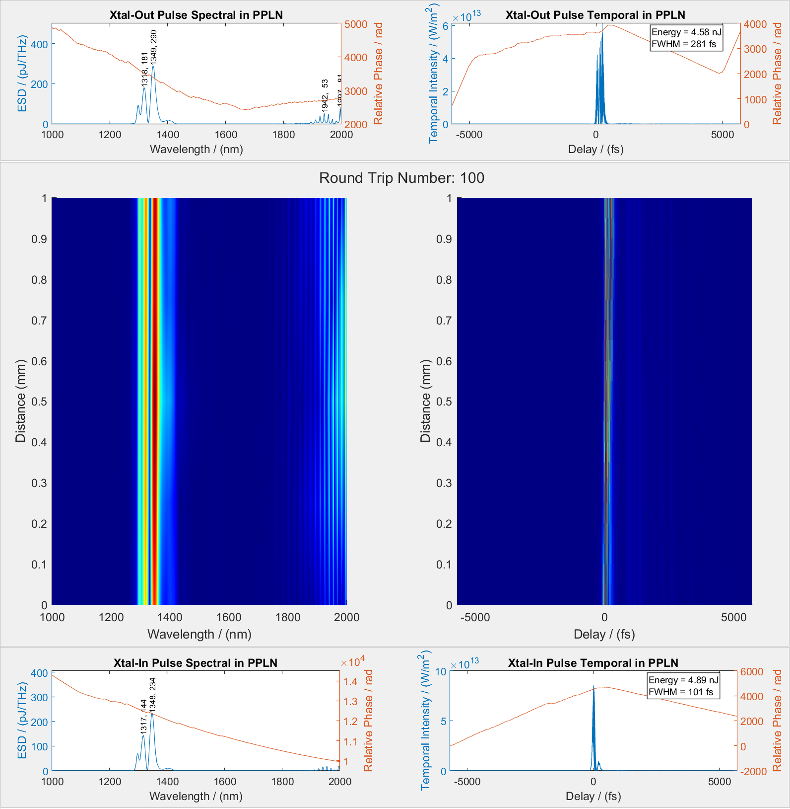


